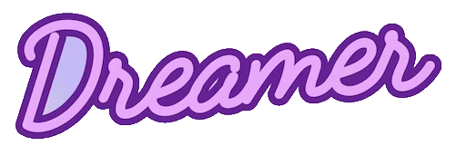

<!-- PROJECT LOGO -->
<br />
<div align="center">
  <a href="https://github.com/othneildrew/Best-README-Template">
    
  </a>

<h3 align="center">Dreamer Firechat project</h3>

  <p align="center">
    An awesome chat app for application at Dreamerly
    <br />
    <a href="https://github.com/tuantran1295?tab=repositories"><strong>Explore my repositories »</strong></a>
    <br />
    <br />
    <a href="https://bbibacgiang.online/">View my previous project</a>
    ·
    <a href="https://www.linkedin.com/in/tran-quoc-tuan-b338261b3/">Contact me</a>
    ·
    <a href="https://www.linkedin.com/in/tran-quoc-tuan-b338261b3/">Linkedin</a>
  </p>
</div>


<!-- TABLE OF CONTENTS -->
<details>
  <summary>Table of Contents</summary>
  <ol>
    <li>
      <a href="#about-the-project">About The Project</a>
      <ul>
        <li><a href="#built-with">Built With</a></li>
      </ul>
    </li>
    <li>
      <a href="#getting-started">Getting Started</a>
      <ul>
        <li><a href="#prerequisites">Prerequisites</a></li>
        <li><a href="#Important-note">Important note</a></li>
      </ul>
    </li>
    <li><a href="#usage">Usage</a></li>
    <li><a href="#contributing">Contributing</a></li>
    <li><a href="#contact">Contact</a></li>
    <li><a href="#acknowledgments">Acknowledgments</a></li>
  </ol>
</details>


<!-- ABOUT THE PROJECT -->
## About The Project

[![Product Screen Shot][product-screenshot]](https://www.linkedin.com/in/tran-quoc-tuan-b338261b3/)

This project is built for application at Dreamerly company. I want to try some new and trending technologies, they really help to build great quality product in an amazing fast speed despite lacking the support from communities. The application was build in 3 days using Nextjs and Firebase firestore. This can provide very great solutions for a fast-paced
startup. 

Here's why:
* The backend and frontend is merged in to one project, the server-side could communicate with clients in an amazing way.
* No worry about database capacity or stability, firebase is backed by Google with great network infrastructure.
* Built with love from a dreamer.


So let's talk about details in the next sector. The man who is able to write a great document could even do better at coding and techniques.

<p align="right">(<a href="#readme-top">back to top</a>)</p>


### Built With

Built with NextJS for both front-end and back-end, Firebase firestore for database, Pusher framework for push notification. I tried with FCM for notify but a web service that could handle everything may be never good enough at some specific tasks.


<!-- GETTING STARTED -->
## Getting Started

This is instructions on setting up the project locally.
To get a local copy up and running follow these simple steps.

### Prerequisites

This is how to list things you need to use the software and how to install them.
* nodejs
  ```sh
  curl "https://nodejs.org/dist/latest/node-${VERSION:-$(wget -qO- https://nodejs.org/dist/latest/ | sed -nE 's|.*>node-(.*)\.pkg</a>.*|\1|p')}.pkg" > "$HOME/Downloads/node-latest.pkg" && sudo installer -store -pkg "$HOME/Downloads/node-latest.pkg" -target "/"
  ```
* npm
  ```sh
  npm install npm@latest -g
  ```

### Getting Started

1. Clone the repo, cd to the project directory
   ```sh
   git clone git@github.com:tuantran1295/next-messaging-app.git
   ```
2. Install NPM packages
   ```sh
   npm install
   ```
3. Build the project
   ```js
   npm run build
   ```
4. Run in dev environment
   ```js
    npm run dev
    ```

## Important note

To show notification, you have to enable it in the system preference or control panel.
1. Select the main Apple menu, go to System Settings > Notifications.

2. Scroll through the list, locate the Google chrome or some web browser you prefer, select it, and toggle on Allow Notifications.
[![system setting Screen Shot][setting-screenshot]](https://www.linkedin.com/in/tran-quoc-tuan-b338261b3/)


<p align="right">(<a href="#readme-top">back to top</a>)</p>


<!-- USAGE EXAMPLES -->
## Usage

The usage would be discussed in a seperated word document.
_For more information, please refer to the [Documentation](https://docs.google.com/document/d/1R5TBJeA-0TP3r5rxC6nOdZOzxlsEYk0X/edit?usp=sharing&ouid=116020578422845394576&rtpof=true&sd=true)_

<p align="right">(<a href="#readme-top">back to top</a>)</p>


<!-- CONTRIBUTING -->
## Contributing

Contributions are what make the open source community such an amazing place to learn, inspire, and create. Any contributions you make are **greatly appreciated**.

If you have a suggestion that would make this better, please fork the repo and create a pull request. You can also simply open an issue with the tag "enhancement".
Don't forget to give the project a star! Thanks again!

1. Fork the Project https://github.com/tuantran1295/next-messaging-app
2. Create your Feature Branch (`git checkout -b feature/AmazingFeature`)
3. Commit your Changes (`git commit -m 'Add some AmazingFeature'`)
4. Push to the Branch (`git push origin feature/AmazingFeature`)
5. Open a Pull Request

<p align="right">(<a href="#readme-top">back to top</a>)</p>


<!-- CONTACT -->
## Contact

Tran Quoc Tuan - [linkedin](https://www.linkedin.com/in/tran-quoc-tuan-b338261b3/) - tuantran1245@gmail.com

Project Link: [git@github.com:tuantran1295/next-messaging-app.git](git@github.com:tuantran1295/next-messaging-app.git)

<p align="right">(<a href="#readme-top">back to top</a>)</p>


[product-screenshot]: ./public/assets/main-dark.png
[setting-screenshot]: ./public/assets/Mac-noti-setting.png
[Next.js]: https://img.shields.io/badge/next.js-000000?style=for-the-badge&logo=nextdotjs&logoColor=white
[Next-url]: https://nextjs.org/
[React.js]: https://img.shields.io/badge/React-20232A?style=for-the-badge&logo=react&logoColor=61DAFB
[React-url]: https://reactjs.org/
[Angular.io]: https://img.shields.io/badge/Angular-DD0031?style=for-the-badge&logo=angular&logoColor=white
[Angular-url]: https://angular.io/
[Laravel.com]: https://img.shields.io/badge/Laravel-FF2D20?style=for-the-badge&logo=laravel&logoColor=white
[Laravel-url]: https://laravel.com
[Bootstrap.com]: https://img.shields.io/badge/Bootstrap-563D7C?style=for-the-badge&logo=bootstrap&logoColor=white
[Bootstrap-url]: https://getbootstrap.com
[JQuery.com]: https://img.shields.io/badge/jQuery-0769AD?style=for-the-badge&logo=jquery&logoColor=white
[JQuery-url]: https://jquery.com